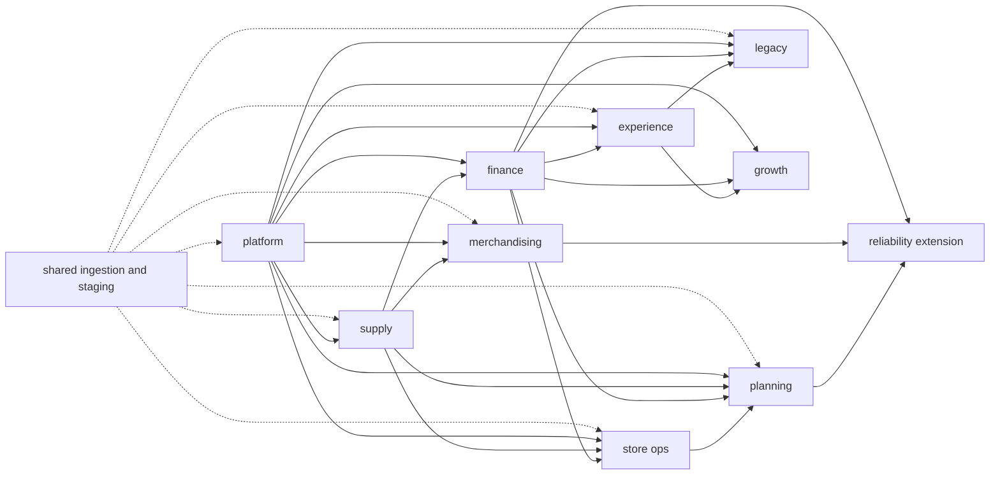

# Architecture

`jaffle-corp` is a Mesh-inspired local dbt monorepo plus a downstream extension
fixture. It demonstrates public interfaces and project boundaries without
pretending that local package installation is the same as deployed dbt Mesh.

For the fictional company flow and the intentional data edge cases behind this
graph, read [Company and Fixture Guide](company-and-fixtures.md).

The `shared` project owns the complete ingestion boundary: raw fixture
seeds, source definitions, domain-organized staging models, cross-project
macros, and schema behavior. It is deliberately installed as a code package.

The `platform` project owns conformed dimensions and stable order-level
interfaces. Downstream projects consume those interfaces instead of reaching
into shared staging tables.

The `supply` project owns recipe components, purchase orders, inventory counts, waste events, component costs, and supply-risk classification.

The `finance` project owns money semantics: payment capture, refunds, FX normalization, and store-level profit and loss. It exposes finance-ready facts for other teams.

The `experience` project owns support tickets, contact threads, experiment exposures, and menu price tests. It joins customer experience signals to order and finance truth without leaking implementation models.

The `growth` project owns campaign, lifecycle, loyalty, experiment conversion, and customer value semantics. It depends on both behavioral and monetary truth because growth reporting commonly needs both.

The `store_ops` project owns kitchen event timing, shifts, quality checks, incidents, and store-day operations by combining platform, supply, and finance facts.

The `merchandising` project owns menu publication windows, product-store availability observations, price adjustment windows, menu goals, product pairings, and substitution readiness.

The `planning` project owns store-hour forecasts, store-product-day forecasts, component-week plans, operating calendars, capacity scenarios, and forecast exception rollups.

The `legacy` project intentionally demonstrates migration debt:
inconsistent naming, mixed grains, hand-rolled currency logic, and deprecated
marts. Its intermediate compatibility adapters reshape public upstream models;
they are not part of the shared source-ingestion boundary.

The `reliability` project is a downstream extension fixture. It consumes
public contracted marts from finance, merchandising, and planning without
depending on their staging or intermediate models.

The `catalog` project is tooling-only. It imports every project as a dbt
package so `scripts/generate_manifest.sh` can emit one full-repo
`target/manifest.json`; it must not own business models.

## Dependency Shape

The graph uses dotted arrows for protected models supplied through the local
`shared` package and solid arrows for domain-to-domain public interfaces.
Catalog-only packaging edges are omitted:

`catalog` observes all of these projects to create the combined manifest;
business projects do not depend on it.

## Package Boundary vs Project Boundary

These relationships are intentionally different:

| Relationship | Declared in | Access rule | Purpose |
| --- | --- | --- | --- |
| Project to `shared` | `packages.yml` | Protected staging is allowed because `shared` sets `restrict-access: false`. | Centralized local ingestion, staging, macros, and fixture seeds. |
| Domain to domain | `dependencies.yml` | Producers set `restrict-access: true`; consumers use public models only. | Stable cross-domain data interfaces. |
| Local domain fallback | `packages.yml` | The same public-only policy is enforced by the producer. | Run dbt Core without hosted project metadata. |
| Catalog observation | `projects/catalog/packages.yml` | Compile-only; no business ownership. | Emit one complete manifest for tooling. |

`shared` is therefore a one-way package dependency, not a peer domain and not a
reciprocal project dependency. Domain projects may consume its protected
staging models, but `shared` must not depend on domain models. Third-party code
packages such as `dbt_utils` follow the same package mechanism and remain in
`packages.yml` in local and hosted environments.

Column meaning follows the same ownership boundary. Each normalized staging
output owns its canonical docs block. A downstream column that preserves the
same name and value references that exact block; a rename, cast, calculation,
aggregation, or multi-source choice owns a model-local definition. See
[Column Documentation](column-documentation.md) for the convention and its
automated lineage check.

## Domain Map

Platform:

- Customers, stores, products, supplies, orders, order items, payments, and
  refunds.

Finance:

- Captured payments, refunds, FX-normalized revenue, recipe-derived margin,
  component cost variance, controls, and daily store profit and loss.

Supply:

- Recipe components, purchase orders, receipts, inventory counts, waste events,
  and component-day risk classification.

Experience:

- Support tickets, contact threads, menu price tests, experiment exposures, and
  seven-day experiment outcomes.

Growth:

- Campaign events, loyalty events, lifecycle, campaign performance, experiment
  conversion, customer value, acquisition, and repeat-purchase metrics.

Store Ops:

- Kitchen timing, shifts, quality checks, incidents, and store-day operating
  health.

Merchandising:

- Menu publication windows, product availability, temporary price adjustments,
  product-pair affinity, substitution readiness, menu goals, and menu margin
  baselines.

Planning:

- Store-hour forecasts, store-product-day forecasts, component-week plan
  variance, capacity planning, operating calendars, capacity scenario windows,
  and planning exception rollups.

Reliability Extension:

- Downstream public-contract consumption, store-day revenue quality plus
  availability, capacity-plan context, and extension-safe tests.

Legacy:

- Deprecated daily store rollups, customer rollups, menu mix reports, old order
  status mappings, mixed currency calculations, and intentionally confusing
  tables for migration exercises.

## Intentional Friction

This repo includes realistic friction points:

- Cross-project refs and local package fallbacks.
- Public models with contracts, protected implementation models, and one
  downstream extension that proves the contracts are usable.
- Multiple metric grains: order, item, customer, store-day, campaign-day, store-hour, product-store-hour, product-store-day, store-product-day, product-pair-day, component-store-week, and scenario-store-day.
- Component, recipe-component, store-component-day, support-ticket, contact-thread, exposure, quality-event, menu-window, forecast, and planning-exception grains.
- Currencies normalized through daily FX rates.
- Refunds, partial captures, loyalty redemptions, component costs, support concessions, shift exceptions, quality checks, and campaign costs.
- Legacy source columns that require normalization before they are usable.
- Snapshots, analyses, exposures, semantic models, MetricFlow queries, and singular tests as operational surface area.

The merchandising and planning domains now expose contracted public marts across
product availability, menu margin, forecast accuracy, capacity planning, and
plan variance. The reliability extension is intentionally small so students can
inspect whether those public interfaces are sufficient before they add another
downstream dependency or change an upstream contract.

## Business capabilities represented with dbt

The fixture uses advanced dbt authoring only where it supports a recognizable
company workflow:

| Workflow | Representative assets | Why it exists |
| --- | --- | --- |
| Ingestion assurance | `customer_ingestion_reconciliation`, `order_ingestion_reconciliation`, and `platform_ingestion_reconciliation` | Compare landed order and customer extracts with their normalized outputs. The order review keeps one business interface while dispatching only the warehouse-specific aggregation syntax. |
| Historical state | `customer_profile_snapshot`, `product_catalog_snapshot`, and `customer_profile_history_probe` | Preserve normalized customer history and raw product-feed history through SQL- and YAML-authored snapshots. |
| Referential integrity | The declared and tested customer relationship on `stg_orders`, plus the normalized-order relationship on `stg_order_items` | Preserve the relationships carried by the landed feeds and verify them with dbt tests instead of implying that DuckDB enforces physical foreign keys on views. |
| Order-pipeline operations | Platform input reporting, the `fct_orders` publication check, the `fct_order_items` orphan gate, statistics maintenance, and `order_pipeline_health` exposure | Report source readiness, refuse incomplete order publications, refresh order statistics only from the owning project, and connect raw volume to the public order metric. |
| Customer follow-up | `order_status_follow_up_policy` and `order_customer_follow_up_queue` | Let Customer Experience apply an owned policy to cancelled, refunded, and unrecognized orders. |
| Legacy migration | Stable and current customer-migration relation helpers, `legacy_surface_inventory`, and `runtime_customer_migration_readiness` | Keep the migration job version-pinned while making the current contract available for an explicit comparison. |
| Reusable reliability logic | The input-readiness operation, `reliability_status`, and `current_store_reliability` | Check the three public inputs before a run, then reuse one store-date status interface in SQL. |
| Campaign economics | `campaign_contribution_usd` and `weekly_campaign_performance` | Query campaign return and contribution together through the Semantic Layer. |
| Time-aware measurement | `year_to_date_net_revenue_usd` and `seven_day_experiment_conversion_rate` | Track annual revenue progress and orders completed within seven days of an experiment exposure. |

Every project in this estate runs on the same pinned dbt Core 1.11.12 stack.
Features that require a different Core or adapter runtime belong in a future
whole-repository upgrade, not in a parallel compatibility fixture.

## Non-Goals

This repo does not model any real marketplace, payments company, mobility company, or logistics company. The domain is fictional food retail only.
