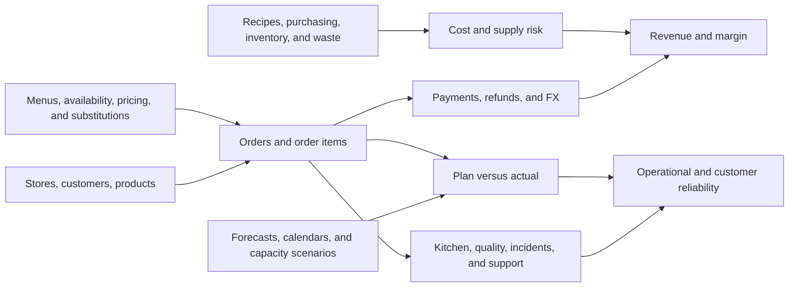

# Company and Fixture Guide

`jaffle-corp` models a fictional food-retail company that sells toasted
jaffles and sides through four stores. The story is deliberately small enough
to inspect row by row, but it crosses the operational boundaries that make a
multi-project dbt estate interesting: commerce, money, supply, customer
experience, growth, store operations, merchandising, and planning.

All names, people, stores, suppliers, and events are synthetic. The fixture is
for architecture exploration, behavior validation, extension work, and tool
testing; it is not for statistical analysis or benchmarking.

## The Company in One Minute

Four stores operate in four currencies and time zones:

| Store | City | Currency | Operating detail |
| --- | --- | --- | --- |
| Crimp Street Jaffles | London | GBP | Conventional storefront |
| Maple Press Jaffles | Toronto | CAD | Conventional storefront |
| Lion City Toasts | Singapore | SGD | Dark kitchen |
| Canal Fold Jaffles | Amsterdam | EUR | Conventional storefront |

The menu contains three jaffles and one side. Customers place orders containing
one or more items; a payment attempt, optional refund, loyalty activity, and
promotion can attach to the order. The same order can then produce kitchen
events, quality checks, waste, an incident, or a support ticket. Recipes,
inventory counts, and purchase orders provide the supply and estimated-cost
context. Menus, availability observations, forecasts, and plans describe what
the company intended to sell and operate before actual results arrived.

This is a business-event flow, not the dbt dependency graph. See
[Architecture](architecture.md) for project ownership and lineage.

## Time Window and Scale

The primary analysis interval is `2026-01-01 00:00:00` inclusive through
`2026-01-08 00:00:00` exclusive. Core orders occur from January 2 through
January 5; support activity continues into January 6; price-test and capacity
windows extend through January 7 or the January 8 boundary.

Reference history intentionally starts earlier. Stores and products have
2024–2025 introduction dates, customer first-seen timestamps begin in November
2025, and weekly goals and plans begin on December 29, 2025. These earlier dates
provide realistic dimension history without turning the fixture into a large
time series.

The committed fixture contains 36 CSV files and 211 data rows. Small counts are
intentional: every scenario should be traceable from a raw row to a mart.

## Seed and Domain Map

All raw fixtures live under `projects/shared/seeds`; the owning domain project
starts at staging or at a contracted upstream mart. Small business-owned lookup
tables stay with their domain, such as Customer Experience's order follow-up
policy under `projects/experience/seeds`. Finance and growth have no dedicated
raw folders because they derive their facts from the core commerce, supply,
experience, and campaign inputs.

| Input family | Files | Rows | What it introduces | Main downstream owners |
| --- | ---: | ---: | --- | --- |
| `platform` | 12 | 61 | Customers, stores, products, orders, items, payments, refunds, FX, loyalty, promotions, supplies, and legacy hours | Platform, finance, growth, legacy |
| `supply` | 4 | 21 | Recipes, purchase orders, inventory counts, and waste | Supply, finance, store operations |
| `experience` | 4 | 21 | Support contacts, tickets, experiment exposures, and menu price tests | Experience, growth |
| `store_ops` | 4 | 25 | Kitchen events, quality checks, incidents, and shift plans | Store operations |
| `merchandising` | 6 | 46 | Menu windows, availability, price adjustments, pairings, substitutions, and goals | Merchandising |
| `planning` | 5 | 32 | Forecasts, calendars, component plans, and capacity scenarios | Planning |
| `experience/reference` | 1 | 5 | Follow-up actions for normalized order statuses | Customer Experience |

Start with [the platform seeds](../projects/shared/seeds/platform) to follow a
single order. Use the other folders when a lab crosses a domain boundary.

## Intentional Edge Cases

The baseline seeds are valid and deterministic. Their friction represents
business states, not accidental corruption.

| Scenario | Seed evidence | Where it first becomes visible |
| --- | --- | --- |
| Source-system status aliases | Orders use `served`, `completed`, `fulfilled`, `partially_refunded`, and `cancel`; payments use `captured`, `settled`, and `declined`. | [`stg_orders`](../projects/shared/models/staging/platform/stg_orders/stg_orders.sql), [`stg_payments`](../projects/shared/models/staging/platform/stg_payments/stg_payments.sql), then [`fct_orders`](../projects/platform/models/marts/fct_orders/fct_orders.sql) |
| Partial refund and cancelled-before-capture | `ord_9003` has a 350 SGD refund; `ord_9004` has a declined zero-value payment and zero-value cancellation refund. | [`fct_order_revenue`](../projects/finance/models/marts/fct_order_revenue/fct_order_revenue.sql) and [`fct_daily_store_pnl`](../projects/finance/models/marts/fct_daily_store_pnl/fct_daily_store_pnl.sql) |
| Currency conversion | Store activity arrives in GBP, CAD, SGD, and EUR, while products are listed in USD and daily FX rates vary by date. | [`dim_exchange_rates`](../projects/platform/models/marts/dim_exchange_rates/dim_exchange_rates.sql), `fct_orders`, and finance marts |
| Incomplete and late receipts | One purchase order receives fewer units than ordered; several receipts arrive after their expected timestamps; one inventory count is marked `review`. | [`fct_purchase_orders`](../projects/supply/models/marts/fct_purchase_orders/fct_purchase_orders.sql) and [`fct_supply_risk_daily`](../projects/supply/models/marts/fct_supply_risk_daily/fct_supply_risk_daily.sql) |
| Availability vocabulary | `featured` normalizes to available, `low_stock` to limited, and `paused` to unavailable; observations also carry outage minutes. | [`stg_product_availability`](../projects/shared/models/staging/merchandising/stg_product_availability/stg_product_availability.sql) and the product-store availability marts |
| Open-ended effective windows | Active menu publications, pairings, and substitution rules have a null end timestamp; one publication and one pairing are retired. | Merchandising interval models and the overlap tests used in Labs 4 and 5 |
| Support without an order | `ticket_005` is open, has no order or resolution timestamp, and has no satisfaction score. | [`fct_support_tickets`](../projects/experience/models/marts/fct_support_tickets/fct_support_tickets.sql) and support SLA metrics |
| Operational exceptions | A failed temperature check, a portion under review, late or lean shifts, service incidents, and reason-coded waste prevent an all-green store story. | Store-operations marts; kitchen timing also feeds planning and downstream reliability |
| Base versus stretch planning | Forecast and capacity inputs include both scenarios at comparable grains. | Planning accuracy, capacity-plan, and exception marts |
| Deliberate legacy debt | Store hours arrive as packed strings; legacy marts retain mixed names, grains, and currency treatment. | [`projects/legacy`](../projects/legacy) and Lab 9 |

Nulls have business meaning in these cases: an uncaptured declined payment, an
open ticket, an active effective-dated row, or a date without a holiday name.
Do not blanket-fill them before deciding what the downstream grain requires.

## Operational Review Surfaces

The estate includes a few terminal assets that a fictional team could use
without knowing how the fixture is tested:

- Platform reconciles landed order and customer extracts with their normalized
  outputs, reports raw-order readiness, and blocks incomplete order or
  order-item publications. Customer Experience applies an owned follow-up
  policy to orders that need attention.
- The order-pipeline health dashboard connects raw order availability, the
  conformed order mart, and the headline order-count metric.
- Growth reviews weekly campaign return and contribution through a saved query.
  Finance and Experience expose year-to-date revenue and seven-day experiment
  conversion semantics.
- The Reliability extension checks its three public upstream interfaces before
  a run and publishes a store-and-date lookup over its store-day fact so
  downstream analysts can reuse the same status logic.
- Legacy migration analyses compare the pinned v1 customer interface with the
  corrected v2 contract and report whether the pinned relation is ready to query.

## Mutations Used by the Labs

Some labs temporarily make the fixture invalid on purpose:

- Lab 4 duplicates a price-adjustment identifier to prove a uniqueness test can
  fail.
- Lab 5 adds an overlapping effective window to exercise interval behavior.
- Lab 7 changes a customer timestamp so a snapshot records another version.

Those mutations are not part of the baseline story. Restore the edited seed
after the exercise and use the repository cleanup workflow when you want a
fresh database and artifact state. The committed CSVs remain the source of
truth.

## How To Read the Fixture

For one concrete trace, follow `ord_9003`:

1. Read the order and its two items in the platform seeds.
2. Compare the captured payment with the partial refund.
3. Follow the kitchen events, failed quality check, and service incident.
4. Open the missing-item support ticket and its contact events.
5. Inspect how platform, finance, experience, and store-operations marts assign
   different meanings to the same business event.

Then repeat the exercise for `ord_9004`, where cancellation, failed payment,
support, promotion, and zero-value refund semantics meet. These two orders
cover most of the fixture's deliberately difficult paths without requiring a
large query result.
